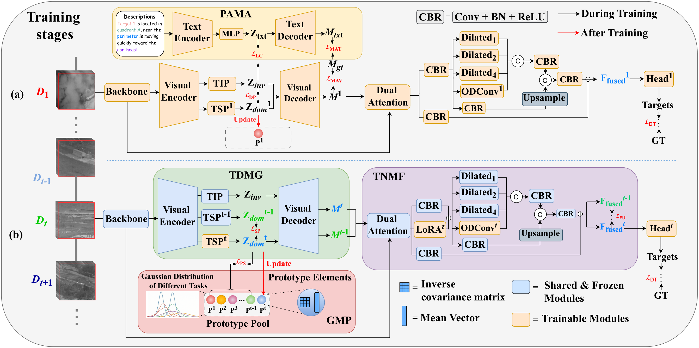

# TaDN

Official PyTorch implementation of **TaDN** for continual moving infrared small-target detection. The model processes short infrared frame sequences and combines a CSPDarknet visual backbone, task-invariant/task-specific motion representations, Gaussian task prototypes, task-aware multi-scale fusion, and task-specific YOLOX detection heads.

## Model architecture

<p align="center">
  
</p>

The upper part of the figure shows the first-task training stage, where language-derived motion priors supervise the visual motion representation. The lower part shows continual learning on subsequent datasets: shared modules are frozen, task-specific prototype statistics are updated, and lightweight LoRA/dynamic-convolution branches and detection heads are trained for each new task.

## Datasets and text encodings

The datasets and the encoded language descriptions/motion relations are provided by the [MoPKL repository](https://github.com/UESTC-nnLab/MoPKL):

- Datasets: **ITSDT-15K**, **DAUB-R**, and **IRDST-H**.
- Language-description embeddings: `emb_train_ITSDT.pkl`, `emb_train_DAUB.pkl`, and `emb_train_IRDST-H.pkl`.
- Motion-relation encodings: `motion_relation_ITSDT.pkl`, `motion_relation_DAUB.pkl`, and `motion_relation_IRDST-H.pkl`.
- COCO JSON annotations and the training TXT files are also available from the same repository.

Download the required files by following the links and extraction codes in the MoPKL README. A typical dataset layout is:

```text
datasets/
├── ITSDT-15K/
│   ├── instances_train2017.json
│   ├── instances_test2017.json
│   ├── coco_train_ITSDT.txt
│   ├── coco_val_ITSDT.txt
│   └── images/
├── DAUB-R/
└── IRDST-H/

embeddings/
├── ITSDT/
│   ├── emb/emb_train_ITSDT.pkl
│   └── relation/motion_relation_ITSDT.pkl
├── DAUB/
└── IRDST/
```

Each line of a training TXT file must use the following format:

```text
/absolute/path/to/frame.bmp x_min,y_min,x_max,y_max,class_id [...]
```

If only COCO JSON annotations are available, edit the paths in `utils_coco/coco_to_txt.py` and run:

```bash
python utils_coco/coco_to_txt.py
```

## Environment

The recommended environment follows the tested MoPKL setup:

- Ubuntu 20.04
- Python 3.11.8
- PyTorch 2.1.1
- torchvision 0.16.1
- CUDA 11.8
- One NVIDIA RTX 3090 GPU

Create an environment and install the main dependencies:

```bash
conda create -n tadn python=3.11.8 -y
conda activate tadn

# Select the PyTorch command appropriate for your CUDA installation if needed.
pip install torch==2.1.1 torchvision==0.16.1 --index-url https://download.pytorch.org/whl/cu118
pip install numpy==1.26.4 opencv-python==4.9.0.80 scipy==1.13.0 \
            pillow tqdm matplotlib tensorboard pycocotools
```

CuPy is optional in the current GMM implementation; NumPy is used as a fallback when CuPy is unavailable.

## Preparation

The released scripts keep experiment paths directly in the Python files. Before training, update the following items:

1. In the selected `train_*.py` file, set:
   - `model_path`: pretrained weights or the best checkpoint from the previous task;
   - `train_annotation_path` and `val_annotation_path`: dataset TXT files;
   - batch size, epoch count, CUDA, FP16, and distributed-training options as required.
2. In the corresponding file under `utils/dataloader*.py`, replace the absolute paths used by `pickle.load(...)` with the downloaded language embedding and motion-relation files.
3. Make sure the imported dataloader matches the dataset being trained. Some paths/imports in the released scripts are experiment-specific and must be changed locally.
4. Keep `num_frame=2` consistent across training and testing unless both the model and data pipeline are changed together.
5. Ensure `nets/training.py` is present. The training entry points import `ModelEMA`, `YOLOLoss`, the learning-rate scheduler, and weight initialization from this file; it is not included in the current code snapshot.

The class list is stored in `model_data/classes.txt`. This repository uses one foreground class by default.

## Training

The three entry points correspond to the three task stages implemented by `PaDN`, `PaDN1`, and `PaDN2`:

| Stage | Entry point | Model file | Default task ID |
| --- | --- | --- | ---: |
| Initial task | `train_IRDST-H.py` | `nets/GMM/PaDN.py` | 0 |
| Second task | `train_ITSDT.py` | `nets/GMM/PaDN1.py` | 1 |
| Third task | `train_DAUB.py` | `nets/GMM/PaDN2.py` | 2 |

Run the stages in order when reproducing continual learning. For every new task, set `model_path` to the previous stage's `best_epoch_weights.pth`, and set the annotation/encoding paths to the current dataset.

```bash
CUDA_VISIBLE_DEVICES=0 python train_IRDST-H.py
CUDA_VISIBLE_DEVICES=0 python train_ITSDT.py
CUDA_VISIBLE_DEVICES=0 python train_DAUB.py
```

Checkpoints and TensorBoard logs are written to a timestamped subdirectory under `logs/`:

```text
logs/loss_YYYY_MM_DD_HH_MM_SS/
├── best_epoch_weights.pth
├── last_epoch_weights.pth
└── epXXX-lossX.XXX-val_lossX.XXX.pth
```

For a single-dataset experiment, use the entry point/model variant associated with the intended task ID and update all dataset-specific paths accordingly.

## Testing

Evaluation uses COCO bounding-box metrics. Edit the following fields in `test.py`:

```python
cocoGt_path      = "/path/to/dataset/instances_test2017.json"
dataset_img_path = "/path/to/dataset/"

class MAP_vid(object):
    _defaults = {
        "model_path": "/path/to/best_epoch_weights.pth",
        "classes_path": "model_data/classes.txt",
        "input_shape": [512, 512],
        "confidence": 0.5,
        "nms_iou": 0.3,
        "cuda": True,
    }
```

Also select the model variant that produced the checkpoint:

```python
from nets.GMM.PaDN import PaDN as Model   # task 0
# from nets.GMM.PaDN1 import PaDN as Model  # task 1
# from nets.GMM.PaDN2 import PaDN as Model  # task 2
```

Then run:

```bash
CUDA_VISIBLE_DEVICES=0 python test.py
```

`map_mode` controls the evaluation procedure:

- `0`: generate detections and run COCO evaluation;
- `1`: generate `map_out/coco_eval/eval_results.json` only;
- `2`: evaluate an existing result JSON only.

The script reports the standard COCO AP/AR summary and additionally writes PR values to `pr_results.txt`. The frame names in each sequence must be numeric (for example, `0.bmp`, `1.bmp`, ...), because `test.py` constructs the two-frame history from the current frame index.

## Acknowledgement

The dataset preparation, annotation format, and language encodings follow [UESTC-nnLab/MoPKL](https://github.com/UESTC-nnLab/MoPKL). Please cite the corresponding dataset and MoPKL papers when using these resources.
